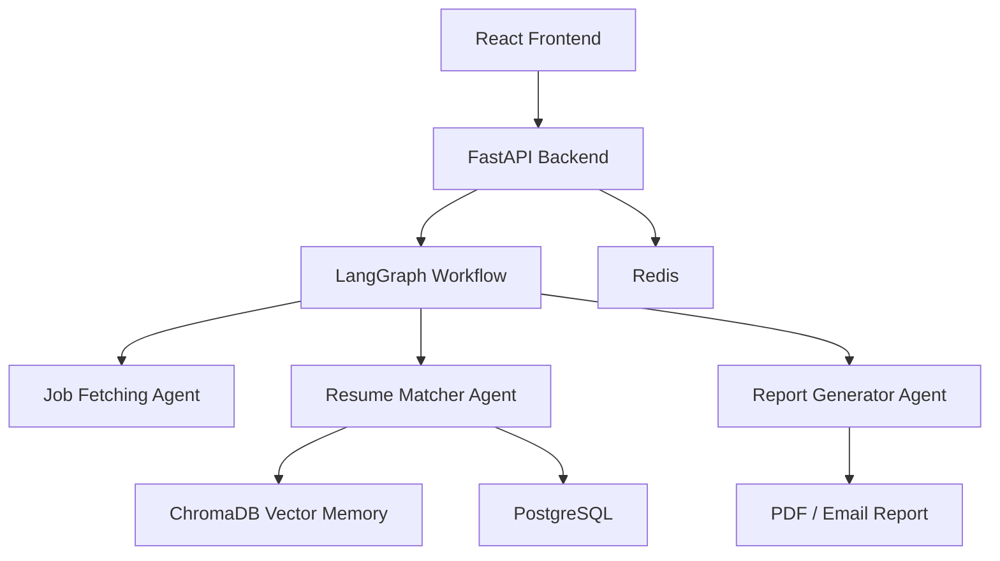
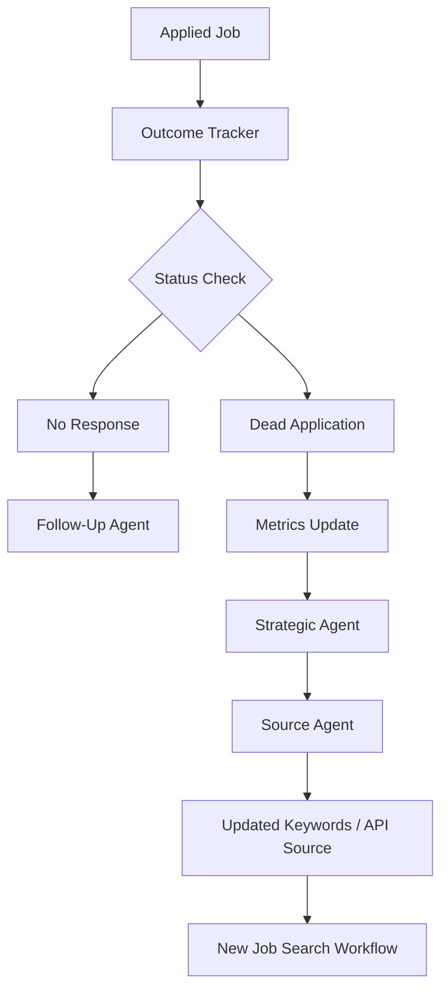

# AI Job Career Operating System

An agentic AI career platform that analyzes resumes, fetches relevant jobs, matches opportunities using RAG, hybrid retrieval, reranking, and generates personalized job reports.

The system is designed as a multi-brain architecture with user-triggered workflows today and optional autonomous outcome tracking for future production deployment.

## Live Demo

Frontend: Coming soon
Backend API: Coming soon
GitHub: This repository

## What It Does

* Upload and parse resumes
* Extract user skills and career profile
* Fetch jobs from external job APIs
* Match jobs using semantic search, hybrid retrieval, and reranking
* Generate personalized job reports
* Track applied jobs through status changes
* Send user notifications and follow-up suggestions
* Support future autonomous loops for strategic job sourcing

## High-Level Workflow

```txt
User uploads resume
→ Resume is parsed
→ LangGraph workflow starts
→ Jobs are fetched
→ Resume and jobs are matched
→ Reranker improves ranking
→ Report is generated
→ User receives matched job report
```

## Autonomous Tracking Workflow

```txt
User clicks apply link
→ Job saved in PostgreSQL as applied
→ Tracking email sent
→ If no reply, status becomes no_response
→ Follow-Up Agent prepares follow-up message
→ If job becomes inactive, status becomes dead_application
→ Metrics update
→ Strategic Agent changes sourcing strategy
→ Source Agent changes keywords/API source
→ New autonomous job search can run
```

## Tech Stack

### Frontend

* React
* Vite
* TypeScript
* Vercel

### Backend

* FastAPI
* Python
* Docker
* LangGraph
* Multi-agent orchestration

### AI / Retrieval

* ChromaDB
* Sentence Transformers
* Hybrid retrieval
* Reranking
* Groq LLM API

### Data / Infrastructure

* PostgreSQL
* Redis
* Docker Compose
* Jaeger observability

## AI-Powered Job Matching

Hybrid retrieval and reranking pipeline used to identify the most relevant opportunities based on candidate profiles.


## Architecture



## Autonomous Architecture



## Deployment Modes

### Production Lite

Used for low-cost deployment.

Enabled:

* FastAPI backend
* Resume upload workflow
* LangGraph workflow
* PostgreSQL
* Redis
* Job matching
* Report generation

Disabled:

* Brain3 strategic loop
* Brain4 outcome loop
* Jaeger
* 24/7 background autonomy

### Full Autonomous Mode

Designed for VPS or larger production deployment.

Enabled:

* Strategic Agent
* Outcome Loop
* Follow-Up Agent
* Source Agent
* Continuous job tracking
* Autonomous refetching
* Observability

## Engineering Highlights

* Built a multi-agent AI workflow system
* Implemented LangGraph-based orchestration
* Integrated PostgreSQL, Redis, and ChromaDB
* Designed production-lite and full-autonomous deployment modes
* Added feature flags for expensive background loops
* Debugged real deployment issues including Docker, CORS, database networking, and memory limits
* Designed adaptive job sourcing based on outcome metrics

## Documentation

* [Architecture](doc/ARCHITECTURE.md)
* [Workflows](doc/WORKFLOWS.md)
* [Deployment](doc/DEPLOYEMENT.md)

## Project Status

Current stage: MVP / Beta

The system currently supports resume-based job matching and report generation. Autonomous tracking and strategic refetch workflows are designed for full production deployment.

## Future Roadmap

* User dashboard
* Payment/subscription system
* Hosted vector database
* Full autonomous job tracking
* Advanced analytics
* Multi-user SaaS scaling
* Worker-based background processing
* Load balancing and monitoring
