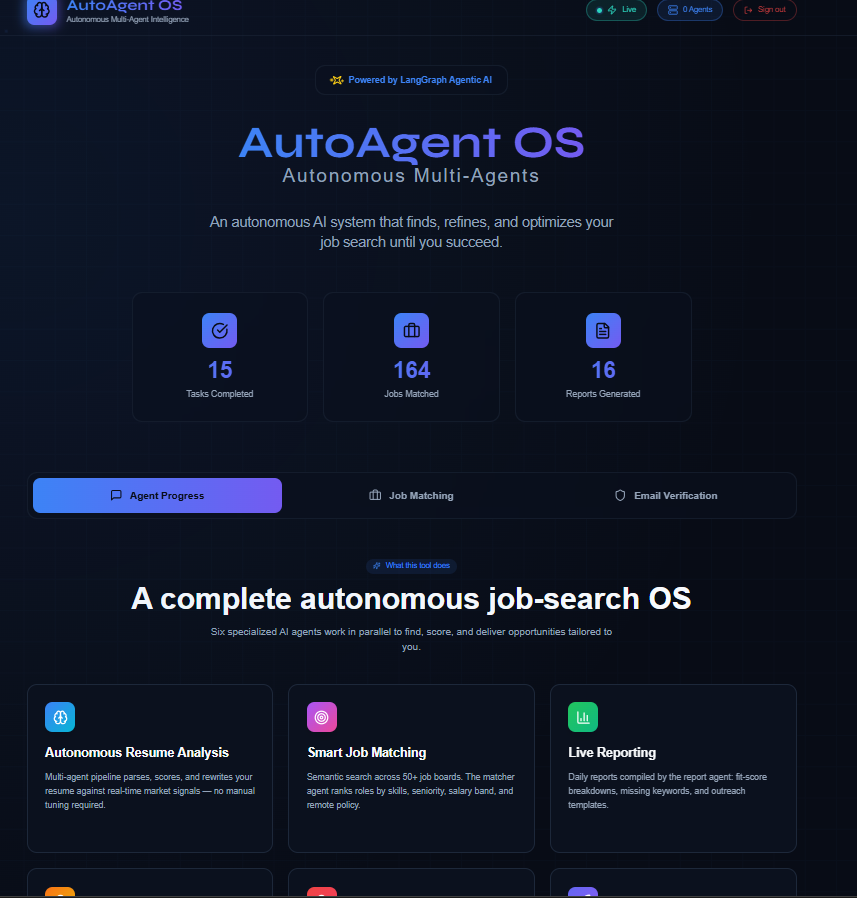
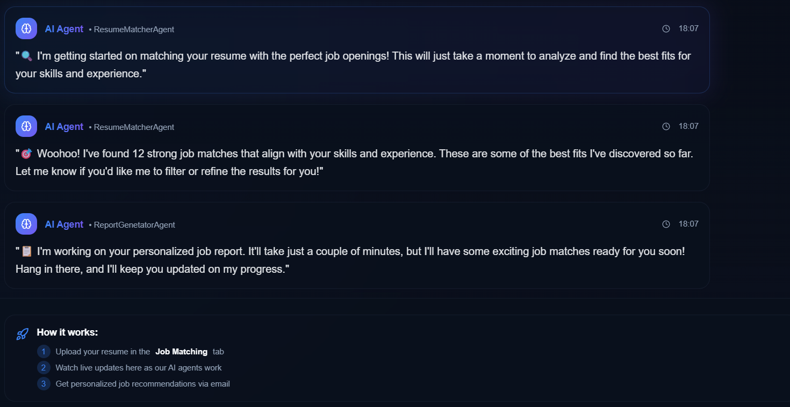
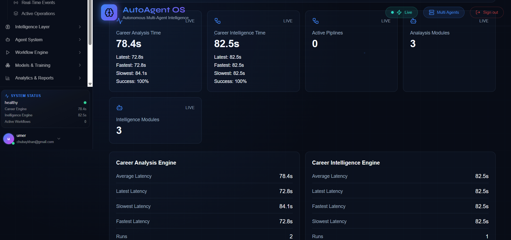
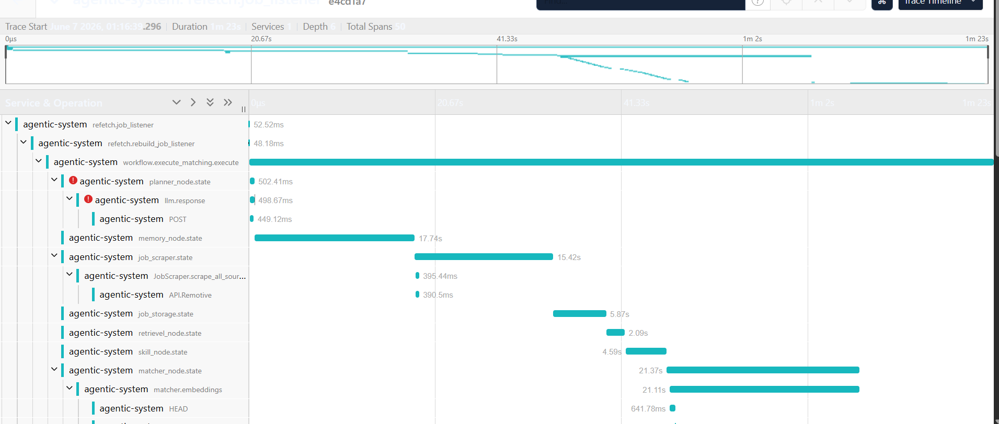
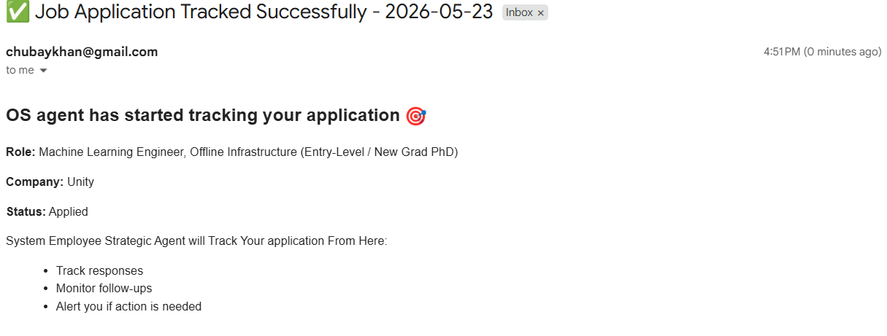
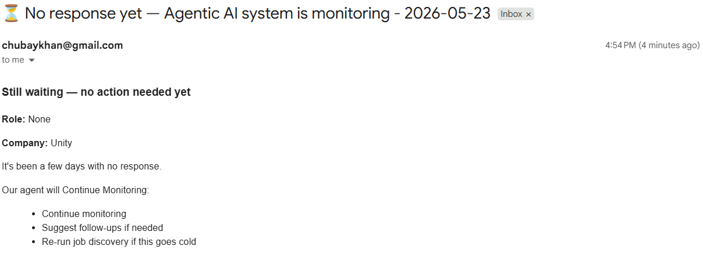
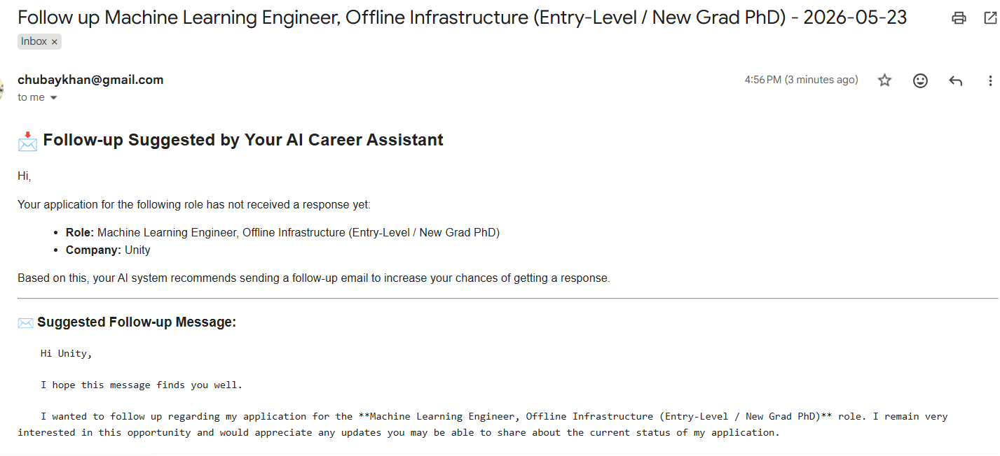
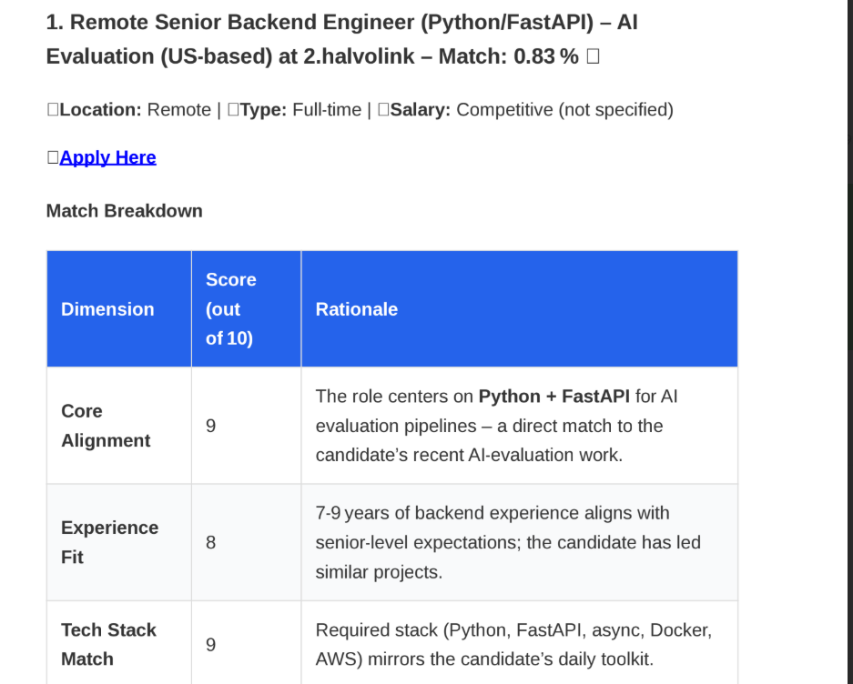
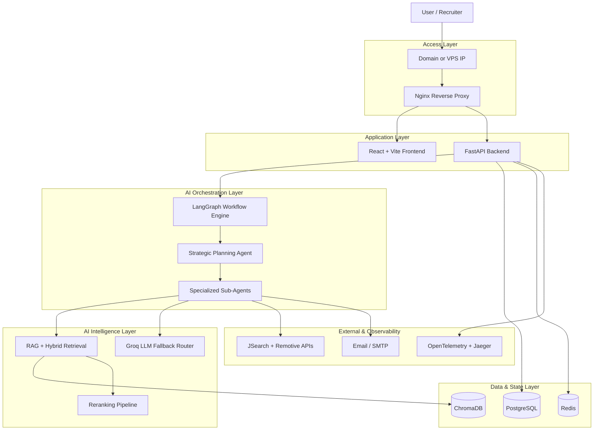
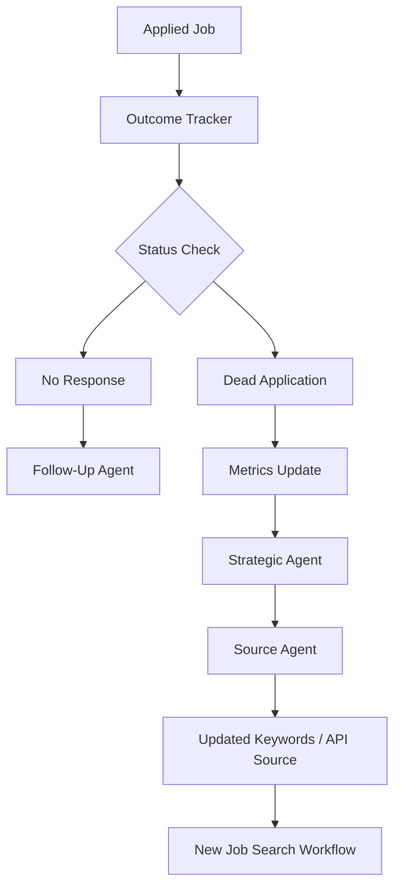

# AI Job Career Operating System

An agentic AI career platform that analyzes resumes, fetches relevant jobs, matches opportunities using RAG, hybrid retrieval, reranking, and generates personalized job reports.

The system is designed as a multi-brain architecture with user-triggered workflows today and optional autonomous outcome tracking for future production deployment.

## Live Demo

Frontend: Coming soon
Backend API: Coming soon
GitHub: This repository

## What It Does

* Uploads and parses user resumes
* Extracts skills and career intelligence using AI
* Fetches jobs from multiple external job APIs with automatic failover
* Performs semantic retrieval, hybrid retrieval, and reranking for high-quality matching
* Generates personalized AI-powered job reports
* Tracks application outcomes and hiring pipeline progress
* Supports autonomous strategic planning and adaptive job sourcing
* Uses fallback LLM routing for resilient AI inference
* Supports production-ready containerized deployment using Docker and Nginx


## High-Level Workflow

```txt
User uploads resume
→ Resume is parsed
→ LangGraph workflow starts
→ Jobs are fetched
→ Resume and jobs are matched
→ Reranker improves ranking
→ Report is generated
→ User receives matched job report
```

## Autonomous Tracking Workflow

```txt
User clicks apply link
→ Job saved in PostgreSQL as applied
→ Tracking email sent
→ If no reply, status becomes no_response
→ Follow-Up Agent prepares follow-up message
→ If job becomes inactive, status becomes dead_application
→ Metrics update
→ Strategic Agent changes sourcing strategy
→ Source Agent changes keywords/API source
→ New autonomous job search can run
```

## Tech Stack

### Frontend

* React
* Vite
* TypeScript
* Vercel

### Backend

* FastAPI
* Python
* Docker
* LangGraph
* Multi-agent orchestration

### AI / Retrieval

* LangGraph
* Multi-Agent Orchestration
* Groq LLMs
* Automatic LLM Fallback Routing
* ChromaDB Vector Memory
* Sentence Transformers
* Hybrid Retrieval (Dense + BM25)
* Reciprocal Rank Fusion
* Cross-Encoder Reranking
* Strategic Reasoning Agents
* Autonomous Planning


### Data / Infrastructure

* PostgreSQL
* Redis
* ChromaDB
* Docker
* Docker Compose
* Docker Networking
* Nginx Reverse Proxy
* Frontend Docker Container
* Backend Docker Container
* Container Health Checks
* Jaeger Distributed Tracing
* OpenTelemetry


## Workflow Demonstrations

### Frontend Dashboard


Modern web interface for managing autonomous workflows, agent interactions, and real-time system operations.

---


## AI-Powered Job Matching

Hybrid retrieval and reranking pipeline used to identify the most relevant opportunities based on candidate profiles.




### User Metrics Dashboard


Comprehensive analytics dashboard providing operational insights, engagement metrics, and system performance monitoring.

---


### Workflow Observability & Distributed Tracing


OpenTelemetry-powered distributed tracing dashboard providing complete visibility into agent orchestration, LLM interactions, memory operations, retrieval pipelines, semantic matching, and workflow execution performance across the autonomous system.


### Job Tracking System


Tracks application progress, workflow status, and hiring pipeline activities automatically.

---


### No Response Detection


Monitors inactive workflows and triggers recovery or escalation procedures automatically.


### Follow-Up Email Automation


Automatically generates and manages professional follow-up communications.

---


### AI Job Analysis Report


Detailed compatibility reports with skill analysis, qualification assessment, and intelligent recommendations.

---


## Production Architecture



```


## Autonomous Architecture



## Deployment Modes

### Production Lite

Used for low-cost deployment.

Enabled:

* FastAPI backend
* Resume upload workflow
* LangGraph workflow
* PostgreSQL
* Redis
* Job matching
* Report generation

Disabled:

* Brain3 strategic loop
* Brain4 outcome loop
* Jaeger
* 24/7 background autonomy

### Full Autonomous Mode

Designed for VPS or larger production deployment.

Enabled:

* Strategic Agent
* Outcome Loop
* Follow-Up Agent
* Source Agent
* Continuous job tracking
* Autonomous refetching
* Observability

## Engineering Highlights

* Designed a multi-agent AI architecture using LangGraph
* Built autonomous strategic planning agents capable of reasoning and delegating work to specialized sub-agents
* Implemented hybrid retrieval using semantic search, BM25, reciprocal rank fusion, and cross-encoder reranking
* Added automatic LLM failover across multiple Groq models for resilient inference
* Implemented multi-source job retrieval with automatic fallback between JSearch and Remotive APIs
* Containerized both frontend and backend using Docker
* Configured Docker Compose with container networking and health checks
* Implemented Nginx reverse proxy for production-ready API routing
* Integrated PostgreSQL, Redis, and ChromaDB into a unified AI platform
* Added distributed tracing with OpenTelemetry and Jaeger
* Designed production-lite and autonomous deployment modes using feature flags
* Built secure JWT authentication with Redis-backed session management


## Reliability & Fault Tolerance

The platform is designed with production resilience in mind.

- Automatic LLM fallback across multiple Groq models
- Automatic Job API failover between JSearch and Remotive
- Container health checks
- Persistent PostgreSQL volumes
- Persistent Redis storage
- Docker networking
- Graceful service startup dependencies
- Nginx reverse proxy


## Documentation

* [Architecture](doc/ARCHITECTURE.md)
* [Workflows](doc/WORKFLOWS.md)
* [Deployment](doc/DEPLOYEMENT.md)


## Project Status

Current Stage: Production-Oriented MVP

Completed

- Multi-Agent Architecture
- LangGraph Orchestration
- Hybrid Retrieval
- Autonomous Strategic Planning
- Dockerized Frontend
- Dockerized Backend
- Docker Networking
- Nginx Reverse Proxy
- PostgreSQL
- Redis
- OpenTelemetry
- Jaeger Observability

In Progress

- Ubuntu VPS Deployment
- HTTPS
- Domain
- CI/CD
- AgentOps
- LLM Evaluations
- AI Guardrails

## Future Roadmap

* User dashboard
* Payment/subscription system
* Hosted vector database
* Full autonomous job tracking
* Advanced analytics
* Multi-user SaaS scaling
* Worker-based background processing
* Load balancing and monitoring
