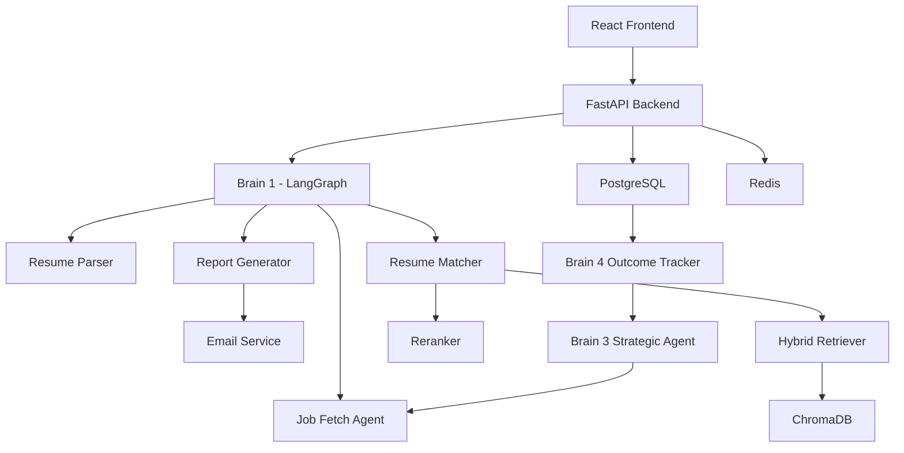

# System Architecture

## Overview

AI Job Career Operating System is a multi-agent, multi-brain career intelligence platform designed to help users discover, track, and optimize job opportunities.

The platform combines:

- LangGraph workflow orchestration
- Event-driven multi-agent execution
- Strategic decision making
- Outcome monitoring
- RAG-powered job matching
- Autonomous sourcing adaptation

---

## Architecture Philosophy

The system is divided into four logical layers:

1. Presentation Layer
2. Workflow Layer
3. Autonomous Intelligence Layer
4. Data Layer

## High Level Architecture

## Brain 1 - LangGraph Workflow Engine

Purpose:

Execute user-triggered workflows.

Responsibilities:

- Resume analysis
- Job retrieval
- Matching
- Report generation
- Workflow orchestration

Activation:

Triggered when the user uploads a resume.

State Management:

Managed through LangGraph state transitions. 

## Brain 2 - Workflow Agent System

Purpose:

Perform specialized tasks during workflow execution.

Agents:

- JobScraperAgent
- ResumeMatcherAgent
- ReportGeneratorAgent
- NotificationAgent
- MemoryMaintenanceAgent

Responsibilities:

- Fetch jobs
- Match jobs
- Generate reports
- Send notifications
- Maintain system memory

## Brain 3 - Strategic Agent

Purpose:

Analyze outcome metrics and improve job sourcing strategy.

Responsibilities:

- Monitor application outcomes
- Evaluate response rates
- Detect sourcing failures
- Generate sourcing policies

Example Decisions:

- Change search keywords
- Modify sourcing strategy
- Switch job APIs
- Adjust matching thresholds

## Brain 4 - Outcome Tracking System

Purpose:

Track the lifecycle of applied jobs.

Tracked Statuses:

- applied
- interview
- offer
- rejected
- no_response
- dead_application

Responsibilities:

- Monitor job progression
- Update outcome metrics
- Trigger follow-up actions
- Feed performance data to Brain 3

## PostgreSQL

Purpose:

Persistent business data storage.

Stores:

- Users
- Applied jobs
- Job statuses
- Metrics
- Outcome history

## Redis

Purpose:

Fast-access runtime state.

Stores:

- Active sessions
- Temporary workflow state
- Cached data
- Event coordination

## ChromaDB

Purpose:

Long-term semantic memory.

Stores:

- Resume embeddings
- Job embeddings
- Match history
- User preference memory

## Hybrid Retrieval Pipeline

The matching engine combines:

1. Dense Retrieval
2. Keyword Retrieval
3. Reciprocal Rank Fusion (RRF)
4. Reranking

Workflow:

Resume
→ Dense Search
→ Keyword Search
→ RRF Fusion
→ Reranker
→ Final Ranking

