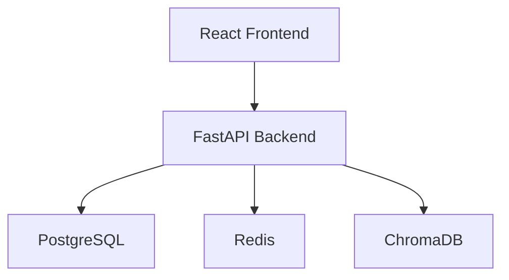

# Deployment Guide

## Deployment Modes

The platform supports two deployment configurations.

### Production Lite

Designed for:

* Railway
* Render
* Low-cost VPS
* Development environments

Enabled:

* Resume Upload Workflow
* Job Matching
* Report Generation
* PostgreSQL
* Redis
* ChromaDB

Disabled:

* Strategic Agent Loop
* Outcome Tracking Loop
* Continuous Autonomous Execution

### Full Autonomous Mode

Designed for:

* VPS
* Dedicated Infrastructure
* Long-running deployments

Enabled:

* Strategic Agent
* Outcome Tracking
* Source Adaptation
* Follow-Up Agent
* Autonomous Refetching

---

# Local Development

## Requirements

* Python 3.11+
* Docker
* Docker Compose
* PostgreSQL
* Redis

## Start Services

```bash
docker-compose up --build
```

## Backend

```bash
uvicorn backend.main:app --reload
```

## Frontend

```bash
npm install
npm run dev
```

---

# Environment Variables

Required:

```env
GROQ_API_KEY=
POSTGRES_URL=
REDIS_URL=
JWT_SECRET=
```

Optional:

```env
JSEARCH_API_KEY=
REMOTIVE_API_KEY=
SENDGRID_API_KEY=
```

---

# Database Services

## PostgreSQL

Responsibilities:

* User data
* Applied jobs
* Metrics
* Job lifecycle tracking

## Redis

Responsibilities:

* Session storage
* Temporary state
* Coordination

## ChromaDB

Responsibilities:

* Resume embeddings
* Job embeddings
* Match history
* User preference memory

---

# Railway Deployment

Suitable for:

* MVP testing
* Early demonstrations

Limitations:

* Memory constraints
* Long-running loops disabled

Recommended Mode:

Production Lite

---

# VPS Deployment

Suitable for:

* Public production deployment
* Long-running services
* Future autonomous execution

Recommended Specifications:

Minimum:

* 2 vCPU
* 4GB RAM

Recommended:

* 4 vCPU
* 8GB RAM

---

# Container Architecture


