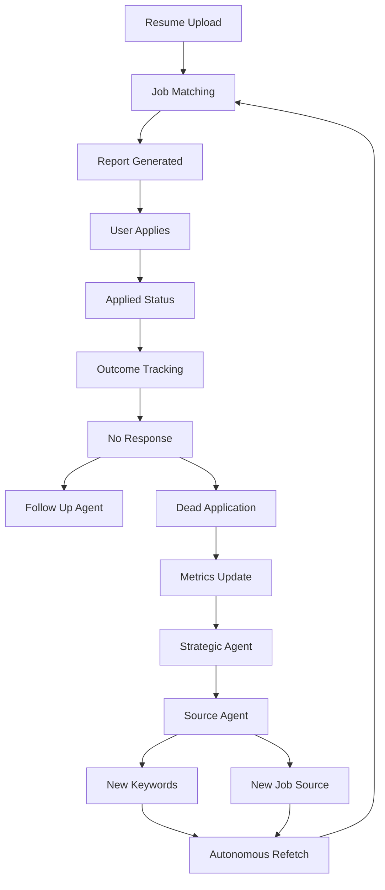

# System Workflows

## Resume Upload Workflow

### Purpose

Convert a user resume into actionable job opportunities.

### Workflow

```txt
User uploads resume
→ Resume Parser
→ Skills Extraction
→ Profile Analysis
→ LangGraph Workflow Start
→ Job Search
→ Hybrid Retrieval
→ Reranking
→ Report Generation
→ Report Delivery
```

### Output

* Structured candidate profile
* Ranked jobs
* Match scores
* Personalized report

## Complete Autonomous Lifecycle




