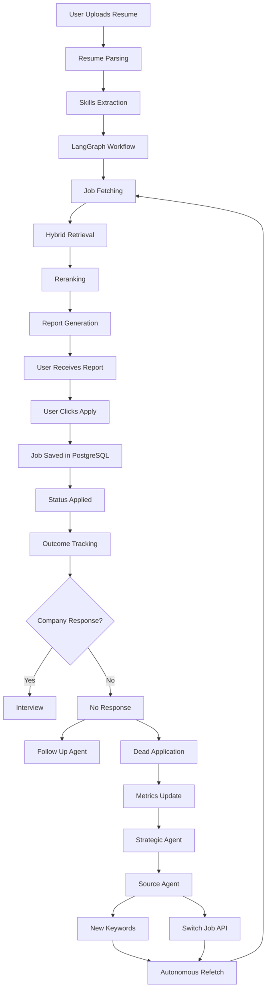

# System Workflows

## Resume Upload Workflow

### Purpose

Convert a user resume into actionable job opportunities.

### Workflow

```txt
User uploads resume
→ Resume Parser
→ Skills Extraction
→ Profile Analysis
→ LangGraph Workflow Start
→ Job Search
→ Hybrid Retrieval
→ Reranking
→ Report Generation
→ Report Delivery
```

### Output

* Structured candidate profile
* Ranked jobs
* Match scores
* Personalized report

## Complete Autonomous Lifecycle



## Workflow Summary

| Workflow | Trigger | Output |
|-----------|-----------|-----------|
| Resume Upload | User uploads resume | Candidate profile |
| Job Retrieval | LangGraph workflow | Job pool |
| Matching | Resume + Jobs | Ranked matches |
| Report Generation | Matching complete | Job report |
| Applied Tracking | User clicks apply | Job lifecycle tracking |
| Follow Up | No response detected | Follow-up email |
| Strategic Analysis | Dead applications increase | New sourcing policy |
| Autonomous Refetch | Policy approved | New job search |


## Why This Is Different

Most AI job platforms stop after matching jobs.

This platform continues tracking application outcomes after the user applies.

The system:

- Tracks application status
- Detects no-response situations
- Generates follow-up recommendations
- Monitors sourcing effectiveness
- Adapts job search strategies
- Switches job sources when performance declines
- Creates autonomous sourcing feedback loops

This transforms the platform from a simple job matcher into an adaptive career operating system.


